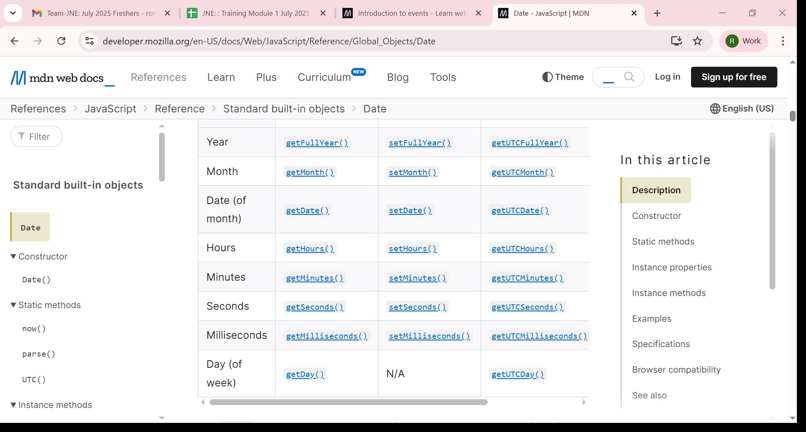

JAVASCRIPT BASICS
JavaScript consists of three main parts 
⦁	ECMAScript provides the core functionality.
⦁	The Document Object Model (DOM) provides interfaces for interacting with elements on web pages
⦁	The Browser Object Model (BOM) provides the browser API for interacting with the web browser.
⦁	The JavaScript engine includes a parser to analyze the code, a compiler to convert it into machine code, and an interpreter to run the compiled code. 
⦁	JavaScript engines include V8 in Chrome, SpiderMonkey in Firefox, and JavaScriptCore in Safari. 
⦁	V8 Has 2 Main Parts That Help Do This 
⦁	Ignition :starts running your JavaScript right away by turning it into bytecode
⦁	TurboFan :V8 watches what parts of the code are used a lot.When something is used often, TurboFan rewrites it in a faster way.
⦁	In 1995, JavaScript was developed by Brendan Eich, a Netscape developer .Initially named Mocha 
⦁	it’s a good practice to use the let keyword to declare variables. 
⦁	Note that JavaScript bundlers remove all whitespace from JavaScript files 
⦁	Identifiers in JavaScript are case-sensitive. 
VARIABLES
⦁	By default, a variable has a special value undefined if you don’t assign it a value. 
⦁	Once you define a constant, you cannot change its value.
⦁	JavaScript strings are immutable 
⦁	To convert values of other types into boolean values, you use the Boolean() 
⦁	Symbol function creates a new unique value every time  Symbol(); 
⦁	console.log(contact.lastName);
⦁	console.log(contact['phone']); // '(408)-555-9999' 
⦁	Note that if you use the Array() constructor to create an array and pass a number into it, you are creating an array with an initial size. 
⦁	let scores = new Array(); 
⦁	let scores = Array(10); 
⦁	The more preferred way to create an array is to use the array literal notation:
⦁	let arrayName = [element1, element2, element3, ...];
⦁	To access an element in an array, you specify an index in the square brackets []: 
 console.log(mountains.length);  Getting the array size
Basic operations on arrays
⦁	 Appending an element to an array:  .push()
⦁	Adding an element to the beginning of an array: .unshift()
⦁	 Removing an element from the end of an array:  .pop(); 
⦁	 Removing an element from the beginning of an array:   .shift(); 
⦁	 Finding an index of an element in the array: .indexOf('North Sea'); 
⦁	Check if a value is an array: .isArray(seas) 
⦁	The switch statement uses the strict comparison (===). 
⦁	let mountains = ['Mount Everest', 'K2', 'Lhotse', 'Kangchenjunga']; let i = 0; while (i < mountains.length) { console.log(`${i + 1}.${mountains[i]}`); i++; } 
⦁	Yes, JavaScript provides a forEach method, which is commonly used to iterate over elements in an array.
⦁	fruits.forEach(function(fruit, index) {
console.log(`Fruit at index ${index}: ${fruit}`);
}); 
⦁	The last parameter (args) is prefixed with the three dots ( ...). It’s called a rest parameter ( ...args). 
⦁	Notice that the rest parameters must appear at the end of the argument list 
⦁	let scores = [80, 90, 70]; for (let score of scores) { 
⦁	ES6 allows you to specify the octal literal by using the prefix 0o followed by a sequence of octal digits from 0 through  
⦁	ES6 added support for binary literals by using the 0b prefix followed by a sequence of binary numbers (0 and 1) 
⦁	export { display }; To use the display() function of the lib.js file in the index.js file, you use ES6 modules.  
⦁	class Person { constructor(name) { this._name = name; } get name() { return this._name; } set name(newName) { newName = newName.trim(); if (newName === ') { throw 'The name cannot be empty'; } this._name = newName; } } 
⦁	Call Stack and Event Loop
A function that takes a long time to complete is called a blocking function. 
⦁	The JavaScript engine places the following function call on the callback queue and executes it when the call stack is empty. In other words, the JavaScript engine executes it after the console.log('Bye!'). 
⦁	JavaScript Hoisting
⦁	When the JavaScript engine executes the JavaScript code, it creates the global execution context. The global execution context has two phases:
⦁	Creation
⦁	Execution
⦁	During the creation phase, the JavaScript engine moves the variable and function declarations to the top of your code. 
⦁	In function  the JavaScript engine also hoists the function declarations. This means that the JavaScript engine also moves the function declarations to the top of the script.
⦁	Function expressions;uring the creation phase of the global execution context, the JavaScript engine creates the add variable in the memory and initializes its value to undefined.When executing the following code, the add is undefined, hence, it isn’t a function
⦁	JavaScript hoisting occurs during the creation phase of the execution context that moves the variable and function declarations to the top of the script.
⦁	The JavaScript engine hoists the variables declared using the let keyword, but it doesn’t initialize them as the variables declared with the var keyword.
⦁	The JavaScript engine doesn’t hoist the function expressions and arrow functions.
⦁	What is variable scope
⦁	Local scope:- The variables that you declare inside a function are local to the function. They are called local variables. 
Block scope
⦁	ES6 provides the let and const keywords that allow you to declare variables in block scope.
⦁	It can be the area within the if, else, switch conditions or for, do while, and while loops. 
⦁	Closures
⦁	a closure gives a function access to its outer scope. In JavaScript, closures are created every time a function is created, at function creation time. 

Promises:
⦁	If the asynchronous operation completes successfully, the executor will call the resolve() function to change the state of the promise from pending to fulfilled with a value. 
⦁	In case of an error, the executor will call the reject() function to change the state of the promise from pending to rejected with the error reason. 
⦁	Async/await:
⦁	Async: Declares an asynchronous function
⦁	Await:  Pauses execution until the Promise settles
⦁	try...catch: Handles errors like catch() in Promises 
⦁  DATE
